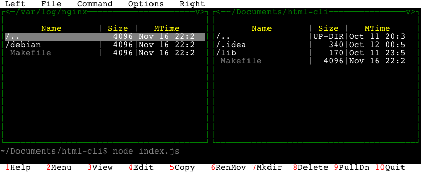

# html-tui

HTML to TUI (Text user interface) renderer. It translates DOM Nodes into Text interface.

[Demo](http://azproduction.github.io/html-tui/example/)
[Playground](http://jsbin.com/dovipasede/edit?html,output)

## Example

```bash
$ npm run ansi
 Left   File   Command   Options   Right
┌<─/var/log/nginx─────────────────────v>┐┌<─~/Documents/html-cli───────────────v>┐
│                                       ││                                       │
│       Name       │ Size │   MTime     ││       Name       │ Size │   MTime     │
│/..               │  4096│Nov 16 22:2  ││/..               │UP-DIR│Oct 11 20:3  │
│/debian           │  4096│Nov 16 22:2  ││/.idea            │   340│Oct 12 00:5  │
│ Makefile         │  4096│Nov 16 22:2  ││/lib              │   170│Oct 11 23:5  │
│                                       ││ Makefile         │  4096│Nov 16 22:2  │
│                                       ││                                       │
│                                       ││                                       │
└───────────────────────────────────────┘└───────────────────────────────────────┘
~/Documents/html-cli$ node index.js

 1Help   2Menu   3View   4Edit   5Copy   6RenMov 7Mkdir  8Delete 9PullDn 10Quit
```



[Live example](http://azproduction.github.io/html-tui/example/)
